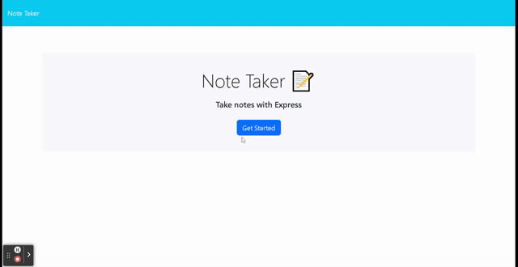

# My Handy Dandy Notebook
  

  ## Description
  This project is an application called Note Taker that can be used to write and save notes.  As a small business owner, this app will help with writing and saving notes so that it can organize thoughts and track tasks that need to be completed.
    
  ## Table of Contents 
  
  - [Installation](#installation)
  - [Usage](#usage)
  - [Credits](#credits)
  - [License](#license)
  - [Contribute](#contribute)
  - [Tests](#tests)
  - [Contact](#questions)

  ## Installation  
  
  
  ## Usage  
  This app is used to write and save notes.  Opening the app will take you to a landing page with a linke to the notes page.  On the notes page the left hand column will have saved notes while the right column will have empty field so that you can write notes.  Buttons will appeatr to save and clear form. 
  

  ## Credits
  This code's front end was provided by professor.
    
  ## License
  

  ## Contribute
  
  Fork
  
  ## Tests
  
  

  ## Questions:
  ### What is the GITHUB link?
  [a-nord](https://github.com/a-nord/The_Notebook)
  ### What is the APPLICATION link?
  [My Handy Dandy Notebook](https://a-nord.github.io/The_Notebook/)
  ### How to contact me if you have any questions?
  [Contact Me 📧](mailto:anord99@yahoo.com)